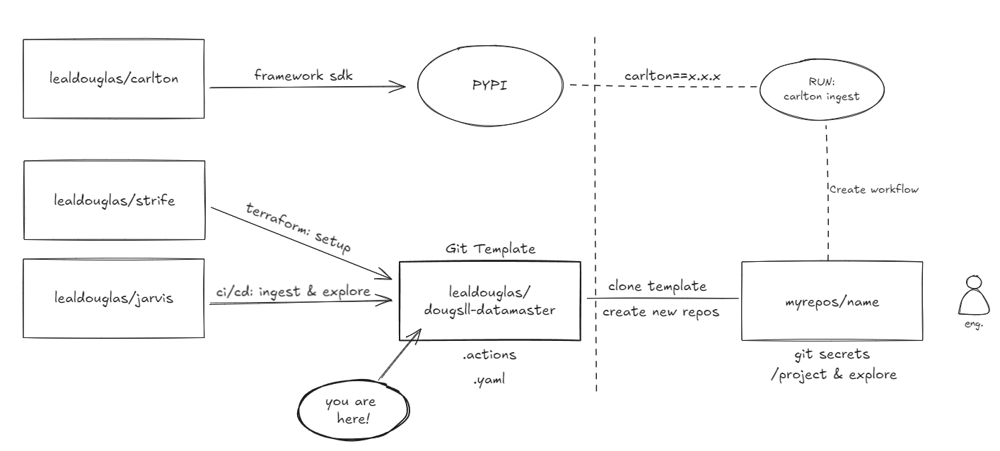

# Data Master - Douglas Leal

&nbsp;

<p align="center">
  
</p>
&nbsp;

O repositório "dougsll-datamaster" é uma solução para o programa Data Master organizado pela F1rst Santander. Solução proposta e desenvolvida por [Douglas Leal](https://www.linkedin.com/in/douglasleall/). <p>

&nbsp;
Este repositório contém o seguinte:

1. [Objetivo do Case](#1-objetivo-do-case)
2. [Arquitetura de Solução](#2-arquitetura-de-solução)
   - [Visão Geral](#21-visão-geral)
   - [Diagrama de Arquitetura de Solução](#22-diagrama-de-arquitetura-de-solução)
   - [Descrição dos Componentes](#23-descrição-dos-componentes)
   - [Características Essenciais (Case)](#24-características-essenciais-case)
3. [Arquitetura Técnica](#3-arquitetura-técnica)
   - [Visão Geral](#31-visão-geral)
   - [Ideação do Projeto](#32-ideação-do-projeto)
   - [Descrição do Fluxo de Dados](#33-descrição-do-fluxo-de-dados)
   - [Tecnologias Utilizadas](#34-tecnologias-utilizadas)
   - [Infraestrutura](#35-infraestrutura)
     - [Provisionamento de Recursos (Terraform)](#351-provisionamento-de-recursos-terraform)
     - [Automação CI/CD (GitHub Actions)](#352-automação-cicd-github-actions)
   - [Processamento de Dados](#36-processamento-de-dados)
     - [Ingestão de Dados (Event Hub)](#361-ingestão-de-dados-event-hub)
     - [Processamento de Dados (Databricks)](#362-processamento-de-dados-databricks)
   - [Armazenamento de Dados](#37-armazenamento-de-dados)
     - [Data Lake (Storage Account)](#371-data-lake-storage-account)
   - [Segurança](#38-segurança)
     - [Políticas de Acesso e Mascaramento de Dados](#381-políticas-de-acesso-e-mascaramento-de-dados)
     - [Autenticação e Autorização](#382-autenticação-e-autorização)
   - [Observabilidade e Monitoramento](#39-observabilidade-e-monitoramento)
     - [Monitoramento de Logs](#391-monitoramento-de-logs)
     - [Alertas e Notificações](#392-alertas-e-notificações)
4. [Instruções para Configuração e Execução do Projeto](#4-instruções-para-configuração-e-execução-do-projeto)
   - [Pré-requisitos](#41-pré-requisitos)
   - [Passos de Configuração](#42-passos-de-configuração)
5. [Melhorias e Considerações Finais](#5-melhorias-e-considerações-finais)
   - [Melhorias Futuras](#51-melhorias-futuras)
   - [Considerações Finais](#52-considerações-finais)
6. [Referências](#6-referências)

&nbsp;

## 1. Objetivo do Case

Este projeto visa desenvolver uma solução de engenharia de dados com o principal objetivo de preparar um ambiente para estudo e exploração de dados baseado em nuvem em poucos minutos. O projeto simula a criação de um ambiente conceitual de dados para um domínio de dados, configurando o ambiente para realizar ações como pipelines de ingestão e exploração de dados.

<p align="center">
  
</p>

## 2. Arquitetura de Solução

### 2.1 Visão Geral

A solução é projetada para preparar um ambiente de estudo e exploração de dados baseado em nuvem em poucos minutos. Considere o seguinte cenário: Eu, como engenheiro de dados e/ou ML, a partir de uma subscrição demoninada como "domínio de dados riscos (drisc)" preciso montar o setup do meu ambiente cloud e criar o pipeline de dados, desde a ingestão até a construção de uma smart table. Nesse cenário, preciso considerar a configuração de um ambiente governado, baseado em uma arquitetura de medallion, explorar dados e implantar um motor. A solução deve permitir ao desenvolvedor configurar seu ambiente, simulando uma prateleira de recursos para dados, e, com poucas configurações, definir um fluxo de ingestão e entregar um ambiente para exploração de dados, integrado à jornada de implantação. Toda a jornada apresentada em um só lugar, de maneira básica e bem feita.

### 2.2 Diagrama de Arquitetura de Solução

<p align="center">
  
</p>

A solução utiliza Azure como provedora de nuvem, Active Directory para gestão de grupos e usuários, Event Hub para ingestão de dados (opcional), Databricks para processamento e análise, Unity Catalog para governança e gestão dos dados, e Azure Storage para armazenamento seguro. Outras tecnologias, como o setup via Terraform e o gerenciamento das automações via contrato de dados, que visam simplificar a relação dos serviços com a plataforma e dados, também estão incorporadas nessa solução.

### 2.3 Descrição dos Componentes

- **Event Hub (opcional)**: Captura dados de transações em tempo real de várias fontes, como sistemas de pagamento e bancos.
- **Azure Databricks**: Processa os dados capturados, executa algoritmos de detecção de fraudes e prepara os dados para armazenamento.
- **Azure Storage Account**: Armazena dados brutos e processados em camadas organizadas, conforme a arquitetura de medalhão (bronze, silver, gold).
- **Segurança**: Implementa políticas de mascaramento de dados e criptografia para proteger informações sensíveis.
- **Observabilidade**: Utiliza monitoramento contínuo para garantir o funcionamento correto do sistema, com alertas configurados para falhas e anomalias.

##### Ambição (AVALIAR DEPOIS):

- Relatório no cost analysis
- Lifecycle já implementado
- Bundles Databricks

<p align="center">
  
</p>

### 2.4 Características Essenciais (Case)

- Incluir detalhes da solucao, como metastore e outros

- **Escalabilidade**: A solução é capaz de processar um grande volume de transações simultaneamente, com capacidade de escalonamento horizontal no Event Hub e Databricks.
- **Resiliência**: O sistema tem tolerância a falhas com mecanismos de failover no Event Hub e recuperação automática no Databricks.
- **Segurança**: A proteção de dados sensíveis é garantida através de criptografia e mascaramento.
- **Desempenho**: O pipeline de dados é otimizado para garantir processamento em tempo real, com baixa latência.

## 3. Arquitetura Técnica

### 3.1 Visão Geral

A arquitetura técnica é baseada em uma infraestrutura provisionada via Terraform, com pipelines automatizados usando GitHub Actions, processamento em tempo real no Azure Databricks, e armazenamento seguro de dados no Azure Storage Account.

### 3.2 Sobre o projeto

Todo projeto inicia com uma ideia...

<p align="center">
  
</p>

...que precisa ser organizada.

### 3.3 Ideação do Projeto

Este projeto foi idealizado para que os usuários tenham um ambiente mínimo para explorar dados. Três repositórios foram criados para que, a partir desse git template, seja possível ter um ambiente end-to-end. A ideação está organizada da seguinte forma:

<p align="center">
  
</p>

Onde RUN é uma referência às execuções de ingestão de dados ou de quality, que utilizam a biblioteca para o uso de soluções já implementadas

- [lealdouglas/strife](https://github.com/lealdouglas/strife), setup de infraestrutura (recursos)
- [lealdouglas/jarvis](https://github.com/lealdouglas/jarvis), delivery do pipeline de dados
- [lealdouglas/carlton](https://github.com/lealdouglas/carlton), framework e acelerador.

### 3.4 Descrição do Fluxo de Dados

- **Provisionamento de recursos**: O ambiente é provisionado via Terraform.
- **Configuração**: definicao do contrato de ingestao via .yaml.
- **Ingestão**: Dados são processados no Databricks e armazenados no Data Lake.
- **Processamento**: Monitoramento contínuo para garantir a integridade do fluxo de dados e detectar anomalias.

### 3.4 Tecnologias Utilizadas

- **Terraform**: Para provisionamento de infraestrutura.
- **Azure Active Directory**: Para gestão de grupos e usuários.
- **Azure Event Hub**: Para captura de eventos.
- **Azure Databricks**: Para processamento de dados em escala.
- **Azure Storage Account**: Para armazenamento seguro.
- **GitHub Actions**: Para automação CI/CD.

### 3.5 Infraestrutura

#### Provisionamento de Recursos (Terraform)

- **Scripts Terraform**: Utilizamos scripts Terraform para criar recursos como Event Hub, Databricks e Storage Account.
  - **Event Hub**: Configurado com throughput adequado para suportar o volume de eventos.
  - **Databricks**: Configurado com clusters de autoescalabilidade para processamento eficiente.
  - **Storage Account**: Configurado para armazenar dados brutos e processados com redundância geográfica.

#### Automação CI/CD (GitHub Actions)

- **Workflows**: O GitHub Actions é configurado para automatizar o deploy da infraestrutura e a execução de jobs no Databricks.
  - **Build**: Executa scripts de criação de recursos.
  - **Deploy**: Configura e executa jobs no Databricks.
  - **Monitoramento**: Configura alertas e captura logs de execução.

### 3.6 Processamento de Dados

#### Ingestão de Dados (Event Hub)

- **Configuração**: O Event Hub captura eventos em tempo real, configurado com partitions para garantir alta disponibilidade.
  - **Consumers**: Configurados para alimentar o pipeline de dados no Databricks.

#### Processamento de Dados (Databricks)

- **Configuração de Clusters**: Clusters autoescaláveis configurados para otimizar o processamento de grandes volumes de dados.
- **Scripts de Processamento**: Utilizamos PySpark para ler dados do Event Hub, processá-los, e armazená-los no Data Lake.
  ```python
  # Exemplo de código PySpark
  df = spark.readStream.format("eventhubs").load()
  processed_df = process_data(df)
  processed_df.write.mode("append").parquet("path/to/datalake")
  ```

### 3.7 Armazenamento de Dados

#### Data Lake (Storage Account)

Estrutura: Dados organizados em camadas de bronze, silver e gold, seguindo a arquitetura de medalhão.
Bronze: Dados brutos.
Silver: Dados processados.
Gold: Dados prontos para análise.
Segurança: Criptografia em repouso e controle de acesso via IAM configurados.

### 3.8 Segurança

#### Políticas de Acesso e Mascaramento de Dados

IAM: Políticas configuradas para controlar o acesso a diferentes serviços e dados sensíveis.
Mascaramento de Dados: Dados confidenciais mascarados durante o processamento e armazenamento, usando ferramentas de criptografia nativas.
Autenticação e Autorização
Azure AD: Integrado para gerenciar autenticação e autorização de usuários.

### 3.9 Observabilidade e Monitoramento

#### Monitoramento de Logs

Azure Monitor: Configurado para capturar logs de todos os componentes, com dashboards para visualização de métricas.
Log Analytics: Utilizado para consultas e diagnósticos de problemas.
Alertas e Notificações
Alertas: Configurados para monitorar falhas no pipeline e enviar notificações para a equipe.
Critérios de Alerta: Thresholds configurados para latência e falhas de ingestão/processamento.

## 4. Instruções para Configuração e Execução do Projeto

### 4.1 Pré-requisitos

- Conta na Azure
- Configuração do GitHub Actions
- Instalação do Terraform
- Instalação do Python 3.10 e Poetry

### 4.2 Passos de Configuração

1. Clone o repositório:
   ```sh
   git clone https://github.com/lealdouglas/dougsll-datamaster.git
   cd dougsll-datamaster
   ```
2. Configure suas credenciais da Azure no Terraform.
3. Execute as actions do repositório para criar os recursos:
4. Configure o GitHub Actions para automatizar os jobs no Databricks.
5. Execute o job no Databricks para processar os dados.

## 5. Melhorias e Considerações Finais

### 5.1 Melhorias Futuras

Abaixo, compartilho algumas melhorias consideradas para essa solução e ambições de uma visão completa, considerando que o cenário desenvolvido é apenas um protótipo de uma necessidade maior:

#### Evolução da solução:

- UI e API Services, com serviços integrados e uma interface web configurada, as validações e etapas podem ser orquestradas a partir da interação do usuário com o formulário, onde, a partir das opções, um serviço pode ser acionado ou um repositório/actions pode ser configurado.
- Configurar um cluster para uso conforme etapas do pipeline.
- Escalabilidade: Melhorar o desempenho da ingestão de dados com particionamento de dados.
- Segurança: Implementar autenticação baseada em tokens para APIs de terceiros.
- Observabilidade: Adicionar métricas de performance e latência do pipeline.

#### Melhorias de implementação:

- montar .yaml para tf e incluir usuario principal, para vincular aos grupos.
- parametros recuperados via API para gerar uma imersao na experiencia poderiam estar configurados em um banco de dados.
- Criar classe estruturada para o uso genérico do datacontract, aplicar padroes de SOLID.

### 5.2 Considerações Finais

Este projeto demonstra uma solução que representa o potencial em definir, configurar ambientes e prepara um pipeline de dados sem levar o desenvolvedor (engenheiro de dados/ml) sair da plataforma do desenv, essa tendo todos os acessos e funcionalidades bem estabalecidas, tem a capacidade/autonomia de servir a jornada completa do desenvolvedor. A solucao tambem aborda uma visao onde, a partir de uma subscricao (exemplo do case dominio drisk) é possivel configurar pequenos projetos (actions com a capacidade de criar resource groups, recursos unitários e cenários pré-moldados) com base na finalidade e configurar ambientes desejados, onde a jornada nasce desde o repositorio. Por fim, uma camada de interface web e algumas API's podem absorver algumas validacoes e steps que via git podem parecer complicadas.

## 6. Referências

- [Terraform Documentation](https://www.terraform.io/docs/index.html)
- [Azure Databricks Documentation](https://learn.microsoft.com/en-us/azure/databricks/)
- [Azure Event Hub Documentation](https://learn.microsoft.com/en-us/azure/event-hubs/)
- [GitHub Actions Documentation](https://docs.github.com/en/actions)
- [Poetry Documentation](https://python-poetry.org/docs/)
- [Data Contract](https://datacontract.com/)
- [Medallion Architecture](https://www.databricks.com/br/glossary/medallion-architecture)

## 6. Referências
