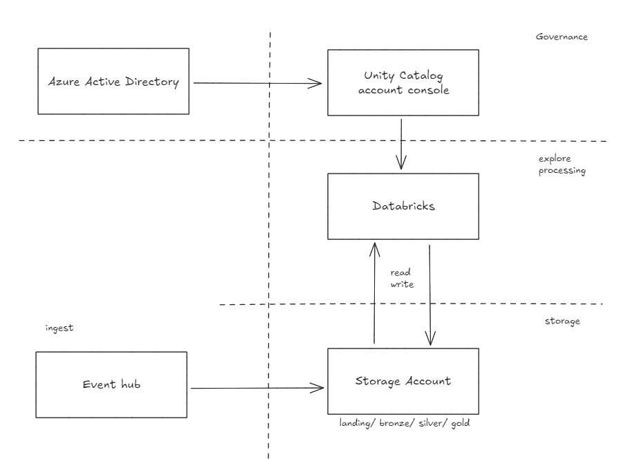
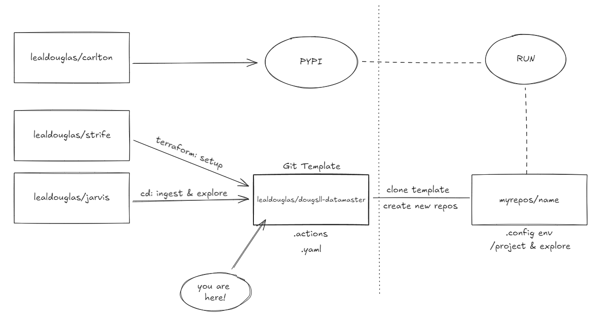

# Data Master - Douglas Leal (Git template)

## 1. Objetivo do Case

Este projeto visa desenvolver uma solução de engenharia de dados com o principal objetivo de preparar um ambiente para estudo e exploração de dados baseado em nuvem em poucos minutos, com foco no monitoramento de transações financeiras em tempo real.

## 2. Arquitetura de Solução

### 2.1 Visão Geral

A solução é projetada para preparar um ambiente para estudo e exploração de dados baseado em nuvem em poucos minutos. Ela utiliza Azure como provedora de nuvem, Active Directory para gestao de grupos e usuários, Event Hub para ingestão de dados (opcional), Databricks para processamento e análise, Unity Catalog para governança e gestão dos dados, e Azure Storage para armazenamento seguro. Outras tecnologias, como o contrato de dados, estão incorporadas nessa solução, que visa simplificar a relação dos servicos com a plataforma e dos dados.

##### Ambição (AVALIAR DEPOIS):

- Relatório no cost analysis
- Lifecycle já implementado
- Bundles Databricks

### 2.2 Descrição dos Componentes

- **Event Hub**: Captura dados de transações em tempo real de várias fontes, como sistemas de pagamento e bancos.
- **Azure Databricks**: Processa os dados capturados, executa algoritmos de detecção de fraudes e prepara os dados para armazenamento.
- **Azure Storage Account**: Armazena dados brutos e processados em camadas organizadas, conforme a arquitetura de medalhão (bronze, silver, gold).
- **Segurança**: Implementa políticas de mascaramento de dados e criptografia para proteger informações sensíveis.
- **Observabilidade**: Utiliza monitoramento contínuo para garantir o funcionamento correto do sistema, com alertas configurados para falhas e anomalias.

### 2.3 Fluxo de Dados

1. **Ingestão de Dados**: As transações financeiras são capturadas em tempo real pelo Event Hub.
2. **Processamento e Análise**: Os dados são enviados para o Databricks, onde são analisados e processados para identificar possíveis fraudes.
3. **Armazenamento**: Os dados processados são armazenados no Data Lake, organizados em diferentes camadas (bronze, silver, gold).
4. **Monitoramento e Alertas**: O sistema é monitorado continuamente, e alertas são gerados em caso de detecção de fraudes ou falhas no pipeline.

### 2.4 Diagrama de Arquitetura de Solução

<p align="center">
  
</p>

### 2.5 Características Essenciais

- **Escalabilidade**: A solução é capaz de processar um grande volume de transações simultaneamente, com capacidade de escalonamento horizontal no Event Hub e Databricks.
- **Resiliência**: O sistema tem tolerância a falhas com mecanismos de failover no Event Hub e recuperação automática no Databricks.
- **Segurança**: A proteção de dados sensíveis é garantida através de criptografia e mascaramento.
- **Desempenho**: O pipeline de dados é otimizado para garantir processamento em tempo real, com baixa latência.

## 3. Arquitetura Técnica

### 3.1 Visão Geral

A arquitetura técnica é baseada em uma infraestrutura provisionada via Terraform, com pipelines automatizados usando GitHub Actions, processamento em tempo real no Azure Databricks, e armazenamento seguro de dados no Azure Storage Account.

### 3.2 Infraestrutura

#### Provisionamento de Recursos (Terraform)

- **Scripts Terraform**: Utilizamos scripts Terraform para criar recursos como Event Hub, Databricks e Storage Account.
  - **Event Hub**: Configurado com throughput adequado para suportar o volume de eventos.
  - **Databricks**: Configurado com clusters de autoescalabilidade para processamento eficiente.
  - **Storage Account**: Configurado para armazenar dados brutos e processados com redundância geográfica.

#### Automação CI/CD (GitHub Actions)

- **Workflows**: O GitHub Actions é configurado para automatizar o deploy da infraestrutura e a execução de jobs no Databricks.
  - **Build**: Executa scripts de criação de recursos.
  - **Deploy**: Configura e executa jobs no Databricks.
  - **Monitoramento**: Configura alertas e captura logs de execução.

### 3.3 Processamento de Dados

#### Ingestão de Dados (Event Hub)

- **Configuração**: O Event Hub captura eventos em tempo real, configurado com partitions para garantir alta disponibilidade.
  - **Consumers**: Configurados para alimentar o pipeline de dados no Databricks.

#### Processamento de Dados (Databricks)

- **Configuração de Clusters**: Clusters autoescaláveis configurados para otimizar o processamento de grandes volumes de dados.
- **Scripts de Processamento**: Utilizamos PySpark para ler dados do Event Hub, processá-los, e armazená-los no Data Lake.
  ```python
  # Exemplo de código PySpark
  df = spark.readStream.format("eventhubs").load()
  processed_df = process_data(df)
  processed_df.write.mode("append").parquet("path/to/datalake")
  ```

### 3.4 Armazenamento de Dados

#### Data Lake (Storage Account)

Estrutura: Dados organizados em camadas de bronze, silver e gold, seguindo a arquitetura de medalhão.
Bronze: Dados brutos.
Silver: Dados processados.
Gold: Dados prontos para análise.
Segurança: Criptografia em repouso e controle de acesso via IAM configurados.

### 3.5 Segurança

#### Políticas de Acesso e Mascaramento de Dados

IAM: Políticas configuradas para controlar o acesso a diferentes serviços e dados sensíveis.
Mascaramento de Dados: Dados confidenciais mascarados durante o processamento e armazenamento, usando ferramentas de criptografia nativas.
Autenticação e Autorização
Azure AD: Integrado para gerenciar autenticação e autorização de usuários.

### 3.6 Observabilidade e Monitoramento

#### Monitoramento de Logs

Azure Monitor: Configurado para capturar logs de todos os componentes, com dashboards para visualização de métricas.
Log Analytics: Utilizado para consultas e diagnósticos de problemas.
Alertas e Notificações
Alertas: Configurados para monitorar falhas no pipeline e enviar notificações para a equipe.
Critérios de Alerta: Thresholds configurados para latência e falhas de ingestão/processamento.

## 4. Explicação sobre o Case Desenvolvido

### 4.1 Ideação do Projeto

Este projeto foi idealizado para que os usuários tenham um ambiente mínimo para explorar dados. Três repositórios foram criados para que, a partir desse git template, seja possível ter um ambiente end-to-end. A ideação está organizada da seguinte forma:

<p align="center">
  
</p>

- [lealdouglas/strife](https://github.com/lealdouglas/strife), setup de infraestrutura (recursos)
- [lealdouglas/jarvis](https://github.com/lealdouglas/jarvis), delivery do pipeline de dados
- [lealdouglas/carlton](https://github.com/lealdouglas/carlton), framework e acelerador.

### 4.2 Descrição do Fluxo de Dados

- **Extração de Dados**: Dados de transações são capturados em tempo real através do Event Hub.
- **Ingestão de Dados**: Dados são processados no Databricks e armazenados no Data Lake.
- **Observabilidade**: Monitoramento contínuo para garantir a integridade do fluxo de dados e detectar anomalias.
- **Segurança e Mascaramento**: Dados sensíveis são mascarados durante o processamento para cumprir regulamentações de segurança.

### 4.3 Tecnologias Utilizadas

- **Azure Event Hub**: Para captura de eventos.
- **Azure Databricks**: Para processamento de dados em escala.
- **Azure Storage Account**: Para armazenamento seguro.
- **GitHub Actions**: Para automação CI/CD.
- **Terraform**: Para provisionamento de infraestrutura.

## 5. Instruções para Configuração e Execução do Projeto

### 5.1 Pré-requisitos

- Conta na Azure
- Configuração do GitHub Actions
- Instalação do Terraform
- Instalação do Python 3.10 e Poetry

### 5.2 Passos de Configuração

1. Clone o repositório:
   ```sh
   git clone https://github.com/lealdouglas/dougsll-datamaster.git
   cd dougsll-datamaster
   ```
2. Configure suas credenciais da Azure no Terraform.
3. Execute as actions do repositório para criar os recursos:
4. Configure o GitHub Actions para automatizar os jobs no Databricks.
5. Execute o job no Databricks para processar os dados.

## 6. Melhorias e Considerações Finais

### 6.1 Melhorias Futuras

- montar .yaml para tf e incluir usuario principal, para vincular aos grupos.
- parametros recuperados via API para gerar uma imersao na experiencia poderiam estar configurados em um banco de dados.
- criar classe abstrata para datacontract ficar ainda mais como uma 'interface'
  Escalabilidade: Melhorar o desempenho da ingestão de dados com particionamento de dados.
  Segurança: Implementar autenticação baseada em tokens para APIs de terceiros.
  Observabilidade: Adicionar métricas de performance e latência do pipeline.

### 6.2 Considerações Finais

Este projeto demonstra uma solução escalável e segura para monitoramento de transações financeiras em tempo real, utilizando ferramentas modernas de processamento de dados e automação de infraestrutura.

## 7. Referências

- [Terraform Documentation](https://www.terraform.io/docs/index.html)
- [Azure Databricks Documentation](https://learn.microsoft.com/en-us/azure/databricks/)
- [Azure Event Hub Documentation](https://learn.microsoft.com/en-us/azure/event-hubs/)
- [GitHub Actions Documentation](https://docs.github.com/en/actions)
- [Poetry Documentation](https://python-poetry.org/docs/)
