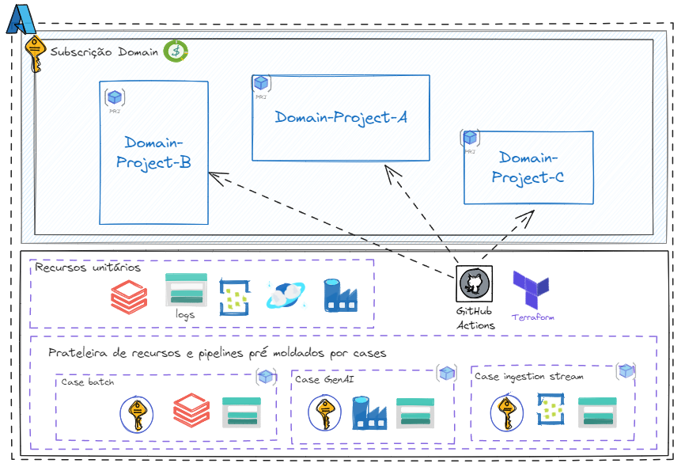
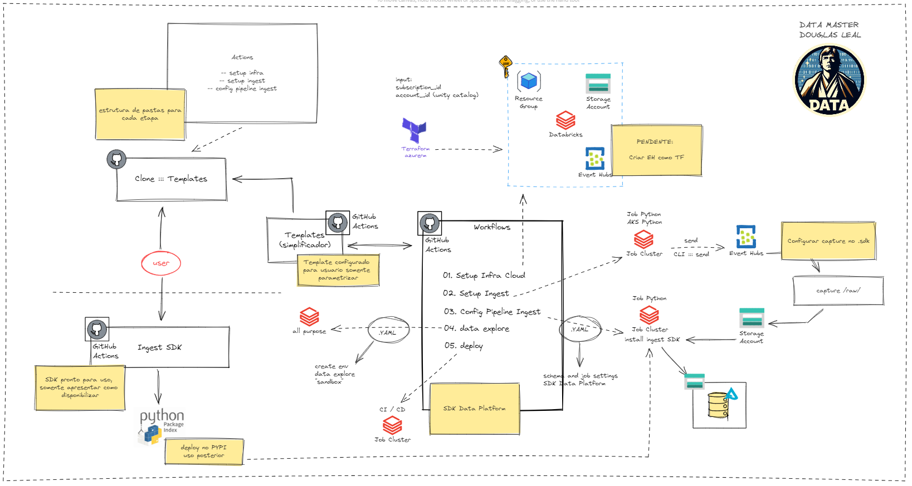
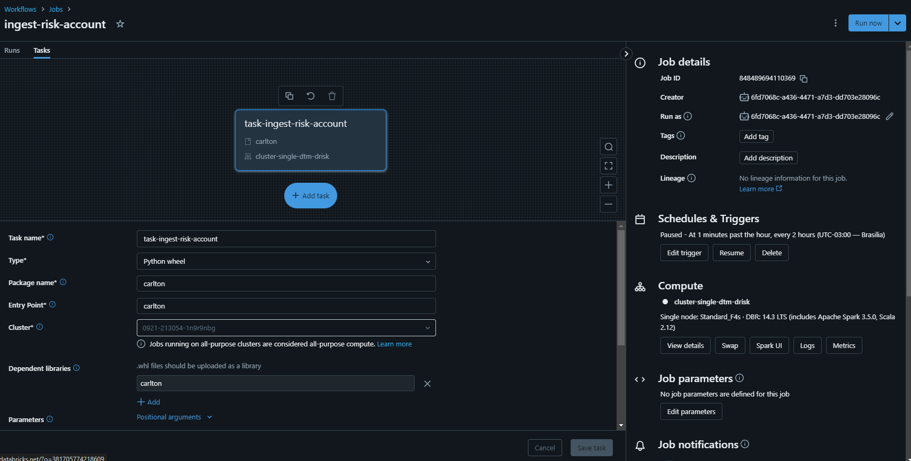

# Data Master - Douglas Leal

&nbsp;

<p align="center">
  
</p>
&nbsp;

O repositório "dougsll-datamaster" é uma solução para o programa Data Master organizado pela F1rst Santander. Solução proposta e desenvolvida por [Douglas Leal](https://www.linkedin.com/in/douglasleall/). <p>

&nbsp;
Este repositório contém o seguinte:

1. [Objetivo do Case](#1-objetivo-do-case)
   - [Início Rápido](#11-início-rápido)
2. [Arquitetura de Solução](#2-arquitetura-de-solução)
   - [Visão Geral](#21-visão-geral)
   - [Diagrama de Arquitetura de Solução](#22-diagrama-de-arquitetura-de-solução)
   - [Descrição dos Componentes](#23-descrição-dos-componentes)
   - [Características Essenciais (Case)](#24-características-essenciais-case)
3. [Arquitetura Técnica](#3-arquitetura-técnica)
   - [Visão Geral](#31-visão-geral)
   - [Sobre o Projeto](#32-sobre-o-projeto)
   - [Ideação do Projeto](#33-ideação-do-projeto)
   - [Descrição do Fluxo de Dados](#34-descrição-do-fluxo-de-dados)
   - [Tecnologias Utilizadas](#35-tecnologias-utilizadas)
   - [Infraestrutura como Código](#36-infraestrutura-como-código)
   - [Automações](#37-automações)
   - [Processamento de Dados](#38-processamento-de-dados)
   - [Armazenamento de Dados](#39-armazenamento-de-dados)
4. [Instruções para Configuração e Execução do Projeto](#4-instruções-para-configuração-e-execução-do-projeto)
   - [Pré-requisitos](#41-pré-requisitos)
   - [Passos de Configuração](#42-passos-de-configuração)
     - [Step 1. Utilize o repos template](#step-1-utilize-o-repos-template)
     - [Step 2. Configure arquivo de Setup Infraestrutura Lakehouse](#step-2-configure-arquivo-de-setup-infraestrutura-lakehouse)
     - [Step 3. Configure usuário de serviço (Service Principal)](#step-3-configure-usuário-de-serviço-service-principal)
     - [Step 4. Configure as secrets no GIT](#step-4-configure-as-secrets-no-git)
     - [Step 5. Execute a action Strife Lakehouse](#step-5-execute-a-action-strife-lakehouse)
     - [Step 6. Recupere Account ID e habilite Account Admin](#step-6-recupere-account-id-do-unity-catalog-e-habilite-account-admin)
     - [Step 7. Execute a action Strife ADB Unity Catalog](#step-7-execute-a-action-strife-adb-unity-catalog)
     - [Step 8. Configure arquivo de contrato para ingestão](#step-8-configure-arquivo-de-contrato-para-ingestão)
     - [Step 9. Execute a action Jarvis Ingestão](#step-9-execute-a-action-jarvis-ingestão)
     - [Step 10. Configure seu projeto para explorar dados](#step-10-configure-seu-projeto-para-explorar-dados)
     - [Step 11. Execute a action Jarvis Asset Bundles](#step-11-execute-a-action-jarvis-asset-bundles)
5. [Melhorias e Considerações Finais](#5-melhorias-e-considerações-finais)
   - [Melhorias Futuras](#51-melhorias-futuras)
   - [Considerações Finais](#52-considerações-finais)
6. [Custos do Projeto](#6-custos-do-projeto)
7. [Referências](#7-referências)

&nbsp;

## 1. Objetivo do Case

Este projeto visa desenvolver uma solução de engenharia de dados com o principal objetivo de preparar um ambiente para estudo e exploração de dados baseado em nuvem em poucos minutos. O projeto simula a criação de um ambiente conceitual de dados para um domínio de dados, configurando o ambiente para realizar ações como pipelines de ingestão e exploração de dados.

### 1.1 Início Rápido

Para provisionar o ambiente e usar a plataforma,
[Instruções para Configuração e Execução do Projeto](#4-instruções-para-configuração-e-execução-do-projeto)

## 2. Arquitetura de Solução

### 2.1 Visão Geral

A solução é projetada para preparar um ambiente de estudo e exploração de dados baseado em nuvem em poucos minutos. Considere o seguinte cenário: Eu, como engenheiro de dados e/ou ML, a partir de uma subscrição demoninada como "domínio de dados riscos (drisc)" preciso montar o setup do meu ambiente cloud e criar o pipeline de dados, desde a ingestão até a construção de uma smart table. Nesse cenário, preciso considerar a configuração de um ambiente governado, baseado em uma arquitetura medalhão, explorar dados e implantar um motor. A solução deve permitir ao desenvolvedor configurar seu ambiente, simulando uma prateleira de recursos para dados, e, com poucas configurações, definir um fluxo de ingestão e entregar um ambiente para exploração de dados, integrado à jornada de implantação. Toda a jornada apresentada em um só lugar, de maneira básica e bem feita.

<p align="center">
  
</p>

### 2.2 Diagrama de Arquitetura de Solução

A solução utiliza Azure como provedora de nuvem, Active Directory para gestão de grupos e usuários, Event Hub para ingestão de dados (opcional), Databricks para processamento e análise, Unity Catalog para governança e gestão dos dados, e Azure Storage para armazenamento seguro. Outras tecnologias, como o setup via Terraform e o gerenciamento das automações via contrato de dados, que visam simplificar a relação dos serviços com a plataforma e dados, também estão incorporadas nessa solução.

<p align="center">
  
</p>

### 2.3 Descrição dos Componentes

- **Event Hub (opcional)**: Captura dados de transações em tempo real de várias fontes, como sistemas de pagamento e bancos.
- **Azure Databricks**: Processa os dados capturados, executa algoritmos de detecção de fraudes e prepara os dados para armazenamento.
- **Azure Storage Account**: Armazena dados brutos e processados em camadas organizadas, conforme a arquitetura de medalhão (bronze, silver, gold).
- **Segurança**: Implementa políticas de mascaramento de dados e criptografia para proteger informações sensíveis.
- **Observabilidade**: Utiliza monitoramento contínuo para garantir o funcionamento correto do sistema, com alertas configurados para falhas e anomalias.

##### Ambição (AVALIAR DEPOIS):

- Relatório no cost analysis
- Lifecycle já implementado
- TTL vinculado ao contrato
- Bundles Databricks

<p align="center">
  
</p>

### 2.4 Características Essenciais (Case)

- Seguindo passos desse projeto em: [passos de Configuração](#42-passos-de-configuração), deve-se ter um ambiente onde,
  - Metastore configurado para uso do catalogo e schemas
  - Contrato de dados para especificar regras de qualidade, padrões dos dados, TTL da informação.
  - Cluster dedicado para uso específico (criado de acordo com o custo do projeto)

## 3. Arquitetura Técnica

### 3.1 Visão Geral

A arquitetura técnica é baseada em uma infraestrutura provisionada via Terraform, com pipelines automatizados usando GitHub Actions, processamento em tempo real no Azure Databricks, e armazenamento seguro de dados no Azure Storage Account.

### 3.2 Sobre o projeto

Todo projeto inicia com uma ideia...

<p align="center">
  
</p>

...que precisa ser organizada.

### 3.3 Ideação do Projeto

Este projeto foi idealizado para que os usuários tenham um ambiente mínimo para explorar dados. Três repositórios foram criados para que, a partir desse git template, seja possível ter um ambiente ponta a ponta. A ideação está organizada da seguinte forma:

<p align="center">
  
</p>

Ao Clonar repos template, o usuário deve setar as variaveis de ambiente necessário no git, configurar os arquivos .yaml e iniciar as execuções.
Na etapa de ingestão, o job executor fará download do pypi para uso do framework padrão da plataforma apresentada.

Repositório adicionais utilizados nesse projeto para experiência imersiva:

- [lealdouglas/strife](https://github.com/lealdouglas/strife), Setup de infraestrutura (recursos). Strife é responsável por entregar esse ambiente pronto para exploração e uso.
- [lealdouglas/jarvis](https://github.com/lealdouglas/jarvis), Delivery do pipeline de dados. Jarvis é responsável por facilitar a adoação e automatizar fluxos utilizados nesse case.
- [lealdouglas/carlton](https://github.com/lealdouglas/carlton), SDK comum padrão da plataforma de dados. Carlton é responsável por padronizar e garantir a qualidade técnica desse case.

### 3.4 Descrição do Fluxo de Dados

- **Provisionamento de recursos**: O ambiente é provisionado via Terraform.
- **Configuração**: Definição do contrato de ingestão via .yaml.
- **Ingestão**: Dados são processados no Databricks e armazenados no Data Lake.
- **Processamento**: Exploração e processamento dos dados no Databricks.

### 3.4 Tecnologias Utilizadas

- **Terraform**: Para provisionamento de infraestrutura.
- **Microsoft Entra ID ou Azure Active Directory**: Para gestão de grupos e usuários.
- **Azure Event Hub**: Para captura de eventos.
- **Azure Storage Account**: Para armazenamento seguro.
- **Databricks**: Para processamento de dados em escala.
- **Databricks Unity Catalog**: Para gestão de grupos, catalogo, schemas e tabelas.
- **GitHub Actions**: Para automação CI/CD.
- **SDK in Pyspark**: SDK padrão para ingestao de dados.

### 3.5 Infraestrutura como Código

#### Provisionamento de Recursos (Terraform)

- **Scripts Terraform**: Utilizamos scripts Terraform para criar recursos como Event Hub, Databricks e Storage Account. Além disso, script é responsável por criar usuários e grupos no Azure Active Directory, sincroniza-los no unity catalog, configurar metastore e schemas baseados na arquitetura medalhão. Recursos criados via terraform nesse projeto,
  - **Event Hub**: Provisionado recurso para ingestões em evento.
  - **Unit Catalog**: Configuração de metastore, sincronização de usuários, configuração de schema e tabelas.
  - **Databricks**: Configurado com cluster single node, para uso de experimentação e baixo custo, proporcionando uma experiência imersiva.
  - **Storage Account**: Configurado para armazenar dados brutos (raw), ingeridos (bronze) e processados (silver).

### 3.6 Automações

#### Automação CI/CD (GitHub Actions)

- **Workflows**: O GitHub Actions é configurado para automatizar o deploy da infraestrutura e a execução de jobs no Databricks.
- **Build**: Executa scripts de criação de recursos.
- **Deploy**: Configura e executa jobs no Databricks.

### 3.6 Processamento de Dados

#### Ingestão de Dados (Event Hub)

- **Configuração**: O Event Hub captura eventos em tempo real, configurado com partitions para garantir alta disponibilidade.
  - **Consumers**: Configurados para alimentar o pipeline de dados no Databricks.

#### Processamento de Dados (Databricks)

- **Configuração de Clusters**: Clusters autoescaláveis configurados para otimizar o processamento de grandes volumes de dados.
- **Scripts de Ingestão e Processamento**: Utilizamos PySpark para ler dados, processá-los, e armazená-los no Data Lake.
  ```python
  # Exemplo de código PySpark
  spark.readStream.format('cloudFiles')
  .options(**autoloader_config)
  .load(config_ingest['carlton_file_path'])
  .select(
      '*',
      current_date().alias('carlton_current_date'),
      col('_metadata').alias('carlton_metadata'),
  )
  ```

### 3.7 Armazenamento de Dados

#### Data Lake (Storage Account)

- **Estrutura**: Dados organizados em camadas de bronze, silver e gold, seguindo a arquitetura de medalhão.
  - **Catalogo**: Catalogo de dados para suportar arquitetura medalhão.
  - **Raw**: landing arquivos.
  - **Bronze**: Dados brutos.
  - **Silver**: Dados processados.
  - **Gold**: Dados prontos para análise.

## 4. Instruções para Configuração e Execução do Projeto

### 4.1 Pré-requisitos

- Conta na Azure
- Subscrição Azure, preferência sem uso.
- Usuário de serviço (Service Principal), conforme [Step 3 - Configure usuário](https://github.com/lealdouglas/dougsll-datamaster?tab=readme-ov-file#step-3-configure-usu%C3%A1rio-de-servi%C3%A7o-service-principal) com as seguintes atribuições:
  - **Owner**, para criar e gerenciar recursos da azure.
  - **Global Administrator**, para sincronizar grupos e usuários do AAD no unity.
  - **Account Admin**, após provisionar ambiente [Step 5 - Setup Lakehouse](https://github.com/lealdouglas/dougsll-datamaster?tab=readme-ov-file#step-5-execute-a-action-strife-lakehouse), para configurar Unity Catalog.
- Definição das variaveis de ambiente:
  - **TF_ARM_TENANT_ID**, conta na azure (tenant)
  - **TF_ARM_SUBSCRIPTION_ID**, subscrição da conta
  - **TF_ARM_CLIENT_ID**, ID do usuário de serviço com permissão para criar recursos e grupos.
  - **TF_ARM_CLIENT_SECRET**, Secret do usuário de serviço com permissão para criar recursos e grupos no AAD.
  - **ADB_ACCOUNT_ID**, ID da console Unity Catalog do Databricks, saiba mais em [Step 6 - Recupere Account ID](https://github.com/lealdouglas/dougsll-datamaster?tab=readme-ov-file#step-6-recupere-account-id-do-unity-catalog-e-habilite-account-admin)

> [!NOTE]
> Não é possível automatizar a captura do account_id via terraform, por isso, no step 6 apresentamos como recuperar manualmente.

Utilize o tópico [Passos de Configuração](#42-passos-de-configuração) para dar sequência ao seu projeto.

### 4.2 Passos de Configuração

#### Step 1. Utilize o repos template

A partir desse repos template, crie um novo para seu projeto.

- Clique em **Use this template** que está ao topo da tela desse repositório.
- Selecione **Create a new repository**
- Defina um nome para seu projeto
- Conclua em **Create repository**

<p align="center">
  
</p>

#### Step 2. Configure arquivo de Setup Infraestrutura Lakehouse

Altere os valores para o qual deseja criar os nomes dos recursos e catálogo

- No repos, acesse **datamaster/strife_env/strife_config.yaml**
  ```yaml
  domain: risk #nome do domínio
  catalog: risk #nome do catálogo
  project: datamaster #nome do projeto
  user_principal_name: account_name#EXT#@mailaccount_name.onmicrosoft.com #usuario principal da conta
  domain_azure: mailaccount_name.onmicrosoft.com #dominio principal da conta, para vincular outros usuarios
  ```

> [!Note]
> Para recuperar domínio e usuário principal da conta, acesse **Users**, selecione seu usuário principal e copie o campo **User principal name**. Onde o valor copiado é o `user_principal_name` e após `@` é o `domain_azure`.

#### Step 3. Configure usuário de serviço (Service Principal)

Crie um usuário de serviço na Azure (Service Principal) com as seguintes atribuições,

- **Owner**, para criar e gerenciar recursos da azure.
  Para configurar um usuário de serviço, você pode fazer via power shell ou via [azure cli](https://learn.microsoft.com/pt-br/cli/azure/install-azure-cli), após acessar o terminal, utilize o comando abaixo para criar o usuário:

  ```sh
  az login
  az ad sp create-for-rbac -n spndatamasteradmin --role Owner --scopes /subscriptions/<SUBSCRIPTION_ID>
  ```

  Onde,

  - **SUBSCRIPTION_ID** é o ID da subscrição da sua conta Azure.
  - O usuário de serviço **spndatamasteradmin** deve ser criado e as variáveis **password** (`TF_ARM_CLIENT_SECRET`) e **appId** (`TF_ARM_CLIENT_ID`) serão exibidas, as utilize-as para [configurar as secrets no git](https://github.com/lealdouglas/dougsll-datamaster?tab=readme-ov-file#step-3-configure-as-secrets-no-git).

- **Global Administrator**, para sincronizar grupos e usuários do AAD no unity.
  Após criar usuário, acesse ao recurso da conta, Microsoft Entra ID, para incluir o usuário a permissão de Global Administrator,

  - Selecione o recurso **Microsoft Entra ID**, o Diretório Padrão (Active Directory)
  - Selecione no canto esquerdo, **Roles and administrators**
  - Busque por **"Global Administrator"**
  - Clique em **Add assignments**
  - Busque pelo seu **usuário de serviço** (SPN)
  - Clique em **add**

<p align="center">
  
</p> 
    
#### Step 4. Configure as secrets no GIT 
Configure as variaveis de ambiente (secrets) em seu repositório Git,
  Para configurar as variáveis, acesse: [Crie secrets para um repositório](https://docs.github.com/pt/actions/security-for-github-actions/security-guides/using-secrets-in-github-actions#creating-secrets-for-a-repository)  
  - **TF_ARM_TENANT_ID**, conta na azure (tenant)
  - **TF_ARM_SUBSCRIPTION_ID**, subscrição da conta
  - **TF_ARM_CLIENT_ID**, ID do usuário de serviço com permissão para criar recursos e grupos no AAD.
  - **TF_ARM_CLIENT_SECRET**, Secret do usuário de serviço com permissão para criar recursos e grupos no AAD.
  - **ADB_ACCOUNT_ID**, ID da console Unity Catalog do Databricks.

<p align="center">
  
</p>

<p align="center">
  
</p>

#### Step 5. Execute a action Strife Lakehouse

- Na tela inicial do repos, clique em **Actions**
- Selecione **01. Strife - Setup Lakehouse**
- Clique no botão a direita, **Run workflow**

<p align="center">
  
</p>

<p align="center">
  
</p>

Após execução, os recursos abaixo serão criados

<p align="center">
  
</p>

> [!Note]
> Um container chamado ctrd`risk`raw será criado para arquivos brutos de ingestão.

> [!WARNING]
> Atenção, importante desabilitar o recurso Network Watcher que tem como objetivo monitorar e gerenciar serviços da sua conta. Para esse projeto não há necessidade. Saiba mais em [ativar_desativar_network_watcher](https://learn.microsoft.com/en-us/azure/network-watcher/network-watcher-create?wt.mc_id=knwlserapi_inproduct_azportal&tabs=portal#disable-network-watcher-for-your-region) e [desative gerenciamento automático](https://learn.microsoft.com/en-us/azure/network-watcher/network-watcher-create?wt.mc_id=knwlserapi_inproduct_azportal&tabs=cli#opt-out-of-network-watcher-automatic-enablement).

#### Step 6. Recupere Account ID do Unity Catalog e habilite Account Admin

Para dar sequencia ao setup, é necessário capturar qual account_id está vinculado ao console do unity catalog, infelizmente não é possível automatizar essa captura via terraform.

- Acesse account console, [accounts.azuredatabricks.net/login](https://accounts.azuredatabricks.net/login/).
- Após copiar account_id no canto superior direito da tela do account, cadastre a secret **ADB_ACCOUNT_ID**.

> [!IMPORTANT]
> Caso sua conta principal não esteja conseguindo logar no account console, utilize o login do campo **User principal name** que encontra-se no perfil da sua conta no AAD.

<p align="center">
  
</p>

> [!NOTE]
> Caso já exista um metastore cadastrado como default, **delete** para que seja feito um a partir desse projeto.

Em seguida, **é importante marcar o usuário de serviço como account_admin**, para que tenha permissão de criar catálogo, metastore, external metastore, schema, tables e outros:

- Clique em **User management** no menu lateral
- Clique na aba **Service principals**
- Selecione seu **service principal pelo id**
- Clique na aba **Roles**
- Habilite a opção **account Admin**
- Faça o mesmo para sua conta principal.

#### Step 7. Execute a action Strife ADB Unity Catalog

- Na tela inicial do repos, clique em **Actions**
- Selecione **02. Strife - Setup Unity Lakehouse**
- Clique no botão a direita, **Run workflow**

<p align="center">
  
</p>

Nessa action, será configurado:

- **Metastore**, chamado primary.
- **Storage Credentials**, para seu metastore e catálogo.
- **External Locations**, para seu metastore e catálogo.
- **Sincronização**, de usuários e grupos do AAD para account e workspace.
- **Cluster single user**, chamado cluster-single-dtm-`DOMAIN`, com autoterminate de 10min, uso ao service principal.
- **Setup do cluster**, mínimo utilizado para esse projeto: _1 Driver; 8 GB Memory, 4 Cores; Runtime 14.3.x-scala2.12_
- **Catálogo**, chamado c`CATALOG`
- **Schemas**, bronze, silver e gold.
- **Permissões**, acesso ao grupo data_engineer aos schemas listados acima.

> [!NOTE]
> Caso não consiga enxergar o catálogo criado, adicione sua conta principal ao grupo **data_engineer** a nível de console e aguarde alguns segundos.

#### Step 8. Configure arquivo de contrato para ingestão

Configure o arquivo .yaml utilizado como referencia para origens de ingestão desse projeto.

- No repos, acesse **datamaster/jarvis_ingest/datacontract.yaml**. Para etapa de ingestão, foque nos principais campos:

```yaml
ingest_workflow:  # Configuração do workflow de ingestão de dados
  model: 'account'  # Modelo de dados a ser utilizado no workflow
  email_notifications:  # Configuração de notificações por email
    on_start: ['email']  # Emails a serem notificados no início do workflow
    on_success: ['email']  # Emails a serem notificados em caso de sucesso do workflow
    on_failure: ['email']  # Emails a serem notificados em caso de falha do workflow
  source:  # Configuração da fonte de dados
    type: 'adls'  # Tipo de fonte de dados (Azure Data Lake Storage)
    format: 'csv'  # Formato dos dados (CSV)
    header: true  # Indica se o arquivo CSV possui cabeçalho
    delimiter: ','  # Delimitador utilizado no arquivo CSV
```

Onde _model_ é a tabela/workflow criado para ingestão.

> [!NOTE]
> Para esse projeto, habilitamos apenas um job, mas uma modelagem proposta é utilizar esse modelo para N models(tabelas) de um mesmo schema.

Para esse projeto habilitamos os _types_ **eventhub** e **adls**. Utilize,

- **eventhub**, para simular uma ingestão streaming
  - Um tópico é criado com base nos parâmetros informados no contrato.
  - Um job mock pode ser criado caso específique no contrato como teste, ou envie mensagens ao tópico se houver alguma aplicação.
- **adls**, para repouso dos dados brutos.
  - Caso tenha arquivos no storage/container raw.

#### Step 9. Execute a action Jarvis Ingestão

- Na tela inicial do repos, clique em **Actions**
- Selecione **03. Jarvis - Create Workflow Ingest**
- Clique no botão a direita, **Run workflow**

Nessa action, será configurado:

- **Databricks Job**, chamado ingest-risk-account, job de ingestão.
- **Databricks Job Task**, chamado task-ingest-risk-account, para fazer o processamento dos dados e gerar a tabela na camada bronze.
- **Topico Event Hub**, _opcional_, caso o _type_ do contrato seja informado eventhub.

<p align="center">
  
</p>

> [!NOTE]
> Orquestração do job configurado com base no contrato, porém pausado para evitar custo inesperado.

#### Step 10. Configure seu projeto para explorar dados

#### Step 11. Execute a action Jarvis Asset Bundles

## 5. Melhorias e Considerações Finais

### 5.1 Melhorias Futuras

Abaixo, compartilho algumas melhorias consideradas para essa solução e ambições de uma visão completa, considerando que o cenário desenvolvido é apenas um protótipo de uma necessidade maior:

#### Evolução da solução e contribuições técnicas:

- UI e API Services, com serviços integrados e uma interface web configurada, as validações e etapas podem ser orquestradas a partir da interação do usuário com o formulário, onde, a partir das opções, um serviço pode ser acionado ou um repositório/actions pode ser configurado.
- Configurar um cluster para uso conforme etapas do pipeline (job cluster, cluster serveless).
- Escalabilidade: Melhorar o desempenho da ingestão de dados com particionamento de dados.
- Segurança: Implementar autenticação baseada em tokens para APIs de terceiros.
- Observabilidade: Adicionar métricas de performance e latência do pipeline.
- Banco de dados, Parâmetros recuperados via API para gerar uma imersão na experiência poderiam estar configurados em um banco de dados
- Implementar mecanimos de multiplas ingestões a partir do contrato.
- Montar .yaml para script terraform e incluir usuario principal (conta), para vincular aos grupos.
- Criar uma classe estruturada para o uso genérico do data contract, aplicando os padrões de SOLID.
- Configurar gerenciamento de versão quando aciona outros componentes Strife, Jarvis e Carlton.
- Configurar a leitura e criacao de ingestao para mais de uma model especificado no contrato de ingestao daquele mesmo schema.

### 5.2 Considerações Finais

Este projeto demonstra uma solução que representa o potencial em definir e configurar ambientes, além de preparar um pipeline de dados, sem exigir que o desenvolvedor (engenheiro de dados/ML) saia da plataforma de desenvolvimento (selecionado o GitHub e actions para esse projeto). Com todos os acessos e funcionalidades bem estabelecidos, a solução tem a capacidade e autonomia de servir toda a jornada do desenvolvedor (actions). A solução também aborda uma visão em que, a partir de uma assinatura (exemplo do case domínio drisk), é possível configurar pequenos projetos (Actions com a capacidade de criar resource groups, recursos unitários e cenários pré-moldados), com base na finalidade e nos ambientes desejados, onde a jornada começa desde a partir da configuração do seu repos. Por fim, uma camada de interface web e APIs podem escalar a solução apresentada.

## 6. Custos do projeto

Esse projeto, executado de ponta a ponta, teve um custo de,

> [!NOTE]
> Devio o tema de custos, não aumentamos a cota da conta, por conta disso apenas um metastore e um cluster single node foi configurado para toda a jornada apresentada.

## 7. Referências

- [Terraform Documentation](https://www.terraform.io/docs/index.html)
- [Azure Databricks Documentation](https://learn.microsoft.com/en-us/azure/databricks/)
- [Azure Event Hub Documentation](https://learn.microsoft.com/en-us/azure/event-hubs/)
- [GitHub Actions Documentation](https://docs.github.com/en/actions)
- [Poetry Documentation](https://python-poetry.org/docs/)
- [Data Contract](https://datacontract.com/)
- [Medallion Architecture](https://www.databricks.com/br/glossary/medallion-architecture)
- [Creating secrets for a repository](https://docs.github.com/pt/actions/security-for-github-actions/security-guides/using-secrets-in-github-actions#creating-secrets-for-a-repository)
- [Create an Azure service principal with Azure CLI](https://learn.microsoft.com/en-us/cli/azure/azure-cli-sp-tutorial-1?tabs=bash)
